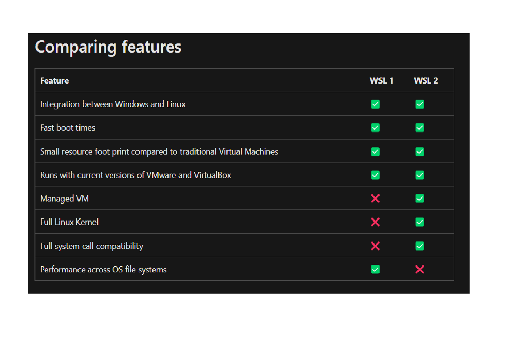
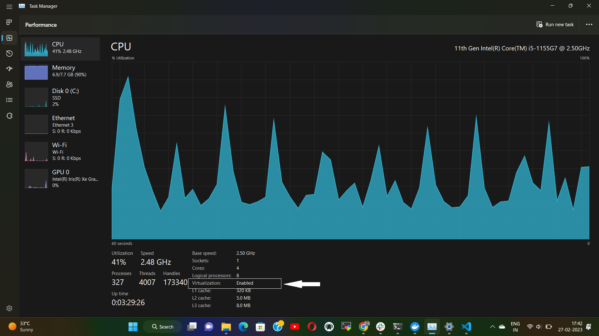
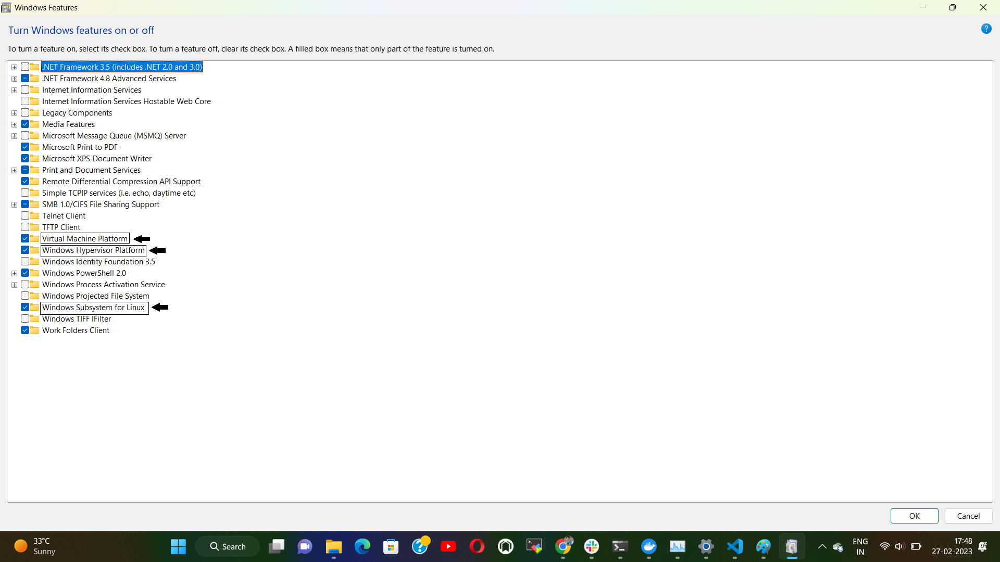

# WSL Overview: 
* As a developer, you will need to access specific coding tools, languages, and frameworks. You may want to install Python and a web development framework like Django, work with JavaScript on a NodeJS backend, or install a cross-platform project that uses React. 
* These programming languages will work on all operating systems. But there are many scenarios that may prefer one operating system to another. Building Windows native desktop apps works best using Windows. Building a web app that will be deployed to a custom Linux server or production-ready Linux Virtual Machine (VM) works best using a Linux environment. 
* Throughout the day, we need to use email and Outlook, create Word docs, Excel spreadsheets, and PowerPoint presentations, and then need to jump on an online call. 
* Rather than using separate machines to handle these needs, some developers choose to dual-boot or run virtual machines (VMs). 
* **Dual-boot**: In the past, running both Windows and Linux on one machine required you to install both operating systems separately and use a boot manager to choose which would run your computer during startup. There are some problems with this, like you need to restart your machine every time you wanted to switch between systems.
* **Virtual Machine**: Virtual Machines (VM) are one way to address the issued of dual-booting two different operating systems. VMs enable you to run a virtualized instance of Linux on a device running Windows. The problem with VMs are slower performance due to the amount of resources that need to be allocated to the running virtual instance, also lack of integration between the two operating systems as you're still running isolated separate systems. 
* **WSL**: WSL addresses these issues by integrating Windows and Linux with a much smaller resource footprint, requiring fewer resources (CPU, memory, storage) compared to traditional Virtual Machines. Windows Subsystem for Linux (WSL) lets developers run a GNU/Linux environment including most command-line tools, utilities, and applications, directly on Windows, unmodified, without the overhead of a traditional virtual machine or dual-boot setup. 
* **WSL advantages over VM**: 
  - It is very much faster to launch a WSL terminal than start up a VM. 
  - much lesser memory requirement than a virtual machine. 
  - integration with windows is much easier with WSL.

* **Common scenarios for using WSL**: A few common situations or scenarios where a developer may want to use WSL include: 
  - A beginner who wants to learn coding on both Windows and Linux environments.
  - A professional developer who wants access to Linux and Windows tools.
  - Any organization that wants to operationalize a Continuous Integration and Continuous Delivery (CICD) workflow, testing updates on a local machine before deploying code updates to the cloud.
  - Anyone who wants to use Docker for creating containers, Git for version control, GPU acceleration for Machine Learning, databases (like MySQL, PostgreSQL, MongoDB, Redis, SQLite), or have access to both Linux GUI apps and Windows at the same time. 

* There are two WSL versions are available i.e. WSL1 and WSL2. The comparison between two is shown in following table. 
     
      &nbsp; 

# WSL Installation Steps 
* **Step 1**: Check whether virtualization is enabled in your system. To check this open "Task Manager". Navigate to "Performances" tab. At bottom look for virtualization. If it is enabled then fine, you may proceed to WSL installation. But if it is disabled, you need to enable it in BIOS settings. To do so you may follow this article : https://www.simplilearn.com/enable-virtualization-windows-10-article.
    
      &nbsp; 
* **Step 2**: If virtaualization is enabled, then go to search and search for "Turn windows features on or off". It will open a window. In that enable options "Virtual machine platform", "Windows Hyperviser platform" and "windows subsystem for linux". 
     
      &nbsp;  

* **Step 3**: Check for windows version and build. You must be running windows 10 or later & version & build requirements are : Version 2004 or later, with Build 19041 or later. To check press "windows key + R" and type "winver" there and press enter. 
* **Step 4**: If your windows fullfills above requirement, open windows powershell as "administrator" and run command `wsl --install`.
* **Step 5**: Next we need to install linux distribution. To see all available linux distributions, run command `wsl --list --online` or `wsl -l -o`. Then install your favourite distribution using command `wsl --install -d <distribution name>`. During installation, you need to configure your linux distribution by providing username & password. To check running distributions & their versions use command `wsl --list --verbose`. You can also install linux distribution directly from microsoft store.  

# Linux Commands
* Linux commands are divided into followining sections: 
  1. Linux Directory Commands: 
     - pwd command: The pwd command is used to display the location of the current working directory.
     - mkdir Command: This is used to create a new directory under any directory. 
     - ls Command: This is used to display a list of content of a directory. 
     - cd Command: The cd command is used to change the current directory.
     - rmdir Command: The rmdir command is used to delete a directory.

  2. Linux File Commands
  3. Linux File Content Commands
  4. Linux User Commands
  5. Linux Filter Commands
  6. Linux Utility Commands
  7. Linux Networking Commands